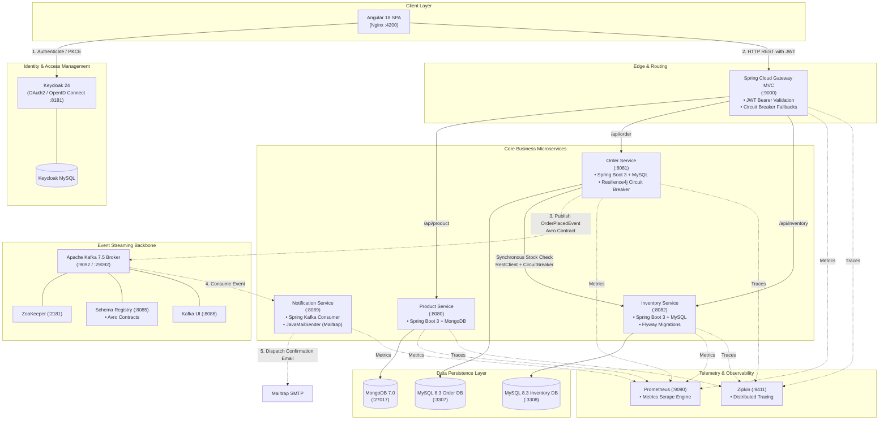

# Event-Driven Microservices E-Commerce Platform

[](https://openjdk.org/projects/jdk/21/)
[](https://spring.io/projects/spring-boot)
[](https://angular.dev/)
[](https://kafka.apache.org/)
[](https://www.keycloak.org/)
[](https://www.docker.com/)
[](https://kubernetes.io/)
[](https://prometheus.io/)
[](https://zipkin.io/)
[](https://opensource.org/licenses/MIT)

A production-grade, polyglot microservices platform designed with cloud-native patterns: **Database-per-Service**, **Event-Driven Architecture**, **API Gateway routing with OAuth2/OIDC security**, **Resilience4j Circuit Breaking**, and **distributed observability** (Prometheus & OpenZipkin).

---

## Architecture Overview



---

## Service Catalog & Port Reference

| Service / Tool | Container Name | Host Port | Internal Port | Protocol / Technology | Responsibility |
| :--- | :--- | :--- | :--- | :--- | :--- |
| **Angular Frontend** | `frontend` | `4200` | `80` | Angular 18, Nginx | Modern e-commerce storefront with Keycloak auth |
| **API Gateway** | `api-gateway` | `9000` | `9000` | Spring Cloud Gateway MVC | Single entry point, JWT validation, circuit breakers |
| **Product Service** | `product-service` | `8080` | `8080` | Spring Boot 3, MongoDB | Catalog management, creation, and browsing |
| **Order Service** | `order-service` | `8081` | `8081` | Spring Boot 3, MySQL | Order checkout, stock check, Kafka event publishing |
| **Inventory Service** | `inventory-service` | `8082` | `8082` | Spring Boot 3, MySQL | SKU inventory tracking and real-time reservation |
| **Notification Service** | `notification-service` | `8089` | `8089` | Spring Boot 3, Kafka, SMTP | Asynchronous order confirmation email delivery |
| **Keycloak IAM** | `keycloak` | `8181` | `8080` | Keycloak 24 (Quay) | Centralized OAuth2 / OpenID Connect Identity Provider |
| **Apache Kafka Broker** | `broker` | `9092` | `29092` | Confluent Kafka 7.5 | Event streaming platform for decoupled microservices |
| **Schema Registry** | `schema-registry` | `8085` | `8081` | Confluent Schema Registry | Centralized schema management with Apache Avro |
| **Kafka UI** | `kafka-ui` | `8086` | `8080` | Provectus Kafka UI | Web dashboard for topics, messages, and consumer groups |
| **MongoDB** | `mongodb` | `27017` | `27017` | Mongo 7.0 | Document store for product catalog |
| **MySQL (Order)** | `mysql-order` | `3307` | `3306` | MySQL 8.3 | Relational database for order transaction records |
| **MySQL (Inventory)** | `mysql-inventory` | `3308` | `3306` | MySQL 8.3 | Relational database for inventory stock levels |
| **Prometheus** | `prometheus` | `9090` | `9090` | Prometheus | Metrics collection from `/actuator/prometheus` targets |
| **OpenZipkin** | `zipkin` | `9411` | `9411` | Zipkin Tracing | Distributed request tracing across all microservice hops |

---

## Project Structure

```text
microservices-ecommerce-platform/
├── docker-compose.yml          # Root multi-container orchestration for the full platform
├── prometheus.yml              # Prometheus scrape jobs for Spring Boot actuator targets
├── .gitignore                  # Production-grade git ignore covering Java, Node, OS, and DB
├── README.md                   # Platform documentation and architecture overview
│
├── services/                   # Backend Microservices (Spring Boot 3 + Java 21)
│   ├── api-gateway/            # Spring Cloud Gateway MVC, OAuth2 JWT Resource Server
│   │   ├── Dockerfile
│   │   ├── pom.xml
│   │   ├── docker/keycloak/    # Pre-configured realm import file (spring-microservices-realm.json)
│   │   └── src/
│   ├── product-service/        # Product Catalog Service (MongoDB)
│   │   ├── Dockerfile
│   │   ├── pom.xml
│   │   └── src/
│   ├── order-service/          # Order Processing Service (MySQL + Kafka Producer + Avro)
│   │   ├── Dockerfile
│   │   ├── pom.xml
│   │   └── src/
│   ├── inventory-service/      # Inventory Stock Management Service (MySQL + Flyway)
│   │   ├── Dockerfile
│   │   ├── pom.xml
│   │   └── src/
│   └── notification-service/   # Notification Dispatcher (Kafka Consumer + Spring Mail)
│       ├── Dockerfile
│       ├── pom.xml
│       └── src/
│
├── frontend/                   # Client Application (Angular 18 + TailwindCSS + Nginx)
│   ├── Dockerfile              # Multi-stage production build (Node 20 -> Nginx Alpine)
│   ├── nginx.conf              # Reverse proxy & SPA routing configuration
│   ├── package.json
│   └── src/
│
└── k8s/                        # Production Kubernetes Manifests
    ├── namespace.yaml          # Dedicated namespace definition
    ├── configmaps/             # Environment configs per microservice
    ├── secrets/                # Credentials (DB passwords, Mailtrap tokens, Keycloak keys)
    ├── infrastructure/         # State manifests (Kafka, MongoDB, MySQL, Prometheus, Zipkin)
    └── services/               # Deployment & Service manifests for all microservices
```

---

## Architectural Highlights & Design Patterns

### 1. Centralized Identity & OAuth2 Resource Server
- Authentication is governed by **Keycloak 24**.
- Frontend logs in via OpenID Connect Authorization Code Flow with **PKCE**.
- Incoming API requests carry signed JSON Web Tokens (`Authorization: Bearer <JWT>`).
- The **API Gateway** verifies the token against Keycloak JWKS and enforces role-based endpoint permissions.

### 2. Polyglot Persistence & Database-per-Service
- **MongoDB** powers `product-service` for schema flexibility and high-throughput read operations.
- **MySQL** powers `order-service` and `inventory-service` ensuring strict ACID transaction guarantees.
- Database changes in `inventory-service` and `order-service` are automated via **Flyway database migrations**.

### 3. Fault Tolerance & Resilience
- Inter-service calls between `order-service` and `inventory-service` use Spring's **RestClient** protected by a **Resilience4j Circuit Breaker**.
- If the inventory service is experiencing high latency or downtime, the circuit breaker opens and redirects to a graceful fallback, preventing cascading thread starvation.

### 4. Asynchronous Event-Driven Messaging with Schema Registry
- Orders trigger an asynchronous `OrderPlacedEvent` emitted to the `order-placed` Kafka topic.
- Event structure is strictly validated at runtime using an **Apache Avro** contract (`order-placed.avsc`) coordinated by the **Confluent Schema Registry**.
- `notification-service` consumes events independently and dispatches HTML emails via SMTP (Mailtrap) without impacting checkout latency.

### 5. Full-Stack Distributed Observability
- All microservices expose standard Spring Boot Actuator endpoints (`/actuator/health`, `/actuator/prometheus`).
- **Micrometer Tracing** propagates trace and span IDs (`traceId`, `spanId`) across HTTP and Kafka headers to **Zipkin**, enabling end-to-end visualization of distributed transactions.

---

## Quickstart Guide

### Prerequisites
- [Docker](https://docs.docker.com/get-docker/) (v24.0 or newer)
- [Docker Compose](https://docs.docker.com/compose/) (v2.20 or newer)
- Minimum 8 GB RAM allocated to Docker daemon (recommended for full stack)

### 1. Launch the Entire Platform
Clone the repository and spin up all 15 containers with a single command:

```bash
git clone https://github.com/d1vyanshu-kumar/microservices-ecommerce-platform.git
cd microservices-ecommerce-platform

# Build and start all infrastructure, databases, and microservices
docker compose up -d --build
```

### 2. Verify Container Health
Check that all containers are healthy and running:

```bash
docker compose ps
```

*Note: On first startup, Keycloak and Kafka take 30-45 seconds to initialize. Spring Boot microservices automatically wait for database health checks before connecting.*

### 3. Access Web Dashboards

| Application | URL | Default Credentials |
| :--- | :--- | :--- |
| **Angular Storefront** | [http://localhost:4200](http://localhost:4200) | - |
| **API Gateway** | [http://localhost:9000](http://localhost:9000) | - |
| **Kafka UI** | [http://localhost:8086](http://localhost:8086) | *No auth required* |
| **Keycloak Administration** | [http://localhost:8181](http://localhost:8181) | Username: `admin`<br/>Password: `admin` |
| **Prometheus Dashboard** | [http://localhost:9090](http://localhost:9090) | *No auth required* |
| **OpenZipkin Tracing UI** | [http://localhost:9411](http://localhost:9411) | *No auth required* |

---

## API Testing & End-to-End Walkthrough

### 1. Retrieve OAuth2 JWT Token from Keycloak
```bash
TOKEN=$(curl -s -X POST 'http://localhost:8181/realms/Spring-microservices-security-realm/protocol/openid-connect/token' \
  -H 'Content-Type: application/x-www-form-urlencoded' \
  -d 'grant_type=password' \
  -d 'client_id=microservices-client' \
  -d 'username=admin' \
  -d 'password=admin' | grep -o '"access_token":"[^"]*' | cut -d'"' -f4)

echo "Token: $TOKEN"
```

### 2. Create a Product (`POST /api/product`)
```bash
curl -X POST http://localhost:9000/api/product \
  -H "Authorization: Bearer $TOKEN" \
  -H "Content-Type: application/json" \
  -d '{
    "skuCode": "iphone_15",
    "name": "iPhone 15 Pro",
    "description": "Titanium finish with A17 Pro Bionic chip",
    "price": 999.00
  }'
```

### 3. Browse Products (`GET /api/product`)
```bash
curl -s http://localhost:9000/api/product | jq .
```

### 4. Check Stock Availability (`GET /api/inventory`)
```bash
curl -s "http://localhost:9000/api/inventory?skuCode=iphone_15&quantity=1"
```

### 5. Place an Order (`POST /api/order`)
```bash
curl -X POST http://localhost:9000/api/order \
  -H "Authorization: Bearer $TOKEN" \
  -H "Content-Type: application/json" \
  -d '{
    "skuCode": "iphone_15",
    "price": 999.00,
    "quantity": 1,
    "userDetails": {
      "email": "customer@example.com",
      "firstName": "Alex",
      "lastName": "Rivera"
    }
  }'
```

### 6. Verify Kafka Event in Kafka UI
Open [http://localhost:8086](http://localhost:8086), navigate to **Topics** -> `order-placed` -> **Messages**. You will see the Avro-serialized `OrderPlacedEvent` emitted by `order-service` and processed by `notification-service`.

---

## Kubernetes Deployment Guide (`k8s/`)

For production environments, all services and infrastructure are packaged into declarative Kubernetes manifests:

```bash
# 1. Create dedicated namespace
kubectl apply -f k8s/namespace.yaml

# 2. Deploy ConfigMaps and Secrets
kubectl apply -f k8s/configmaps/
kubectl apply -f k8s/secrets/

# 3. Deploy Stateful Infrastructure (Databases, Kafka, Keycloak)
kubectl apply -f k8s/infrastructure/

# 4. Deploy Core Microservices and Frontend
kubectl apply -f k8s/services/

# 5. Check Pod and Service status
kubectl get pods,svc -n microservices
```

---

## Local Development (Without Docker Compose)

To run any individual microservice locally during development:

```bash
cd services/product-service
./mvnw clean spring-boot:run
```

Ensure the dependent backing store (e.g., MongoDB on port `27017` or MySQL on port `3306`) is active.

For the frontend:
```bash
cd frontend
npm install
npm run start
```
The Angular CLI dev server will start at `http://localhost:4200` with hot-reloading enabled.

---

## Teardown & Maintenance

To stop all running containers and preserve database volumes:
```bash
docker compose stop
```

To shut down containers and delete all attached persistent volumes:
```bash
docker compose down -v
```

---

## Author & Acknowledgements
- **Divyanshu Kumar** ([@d1vyanshu-kumar](https://github.com/d1vyanshu-kumar))
- Architecture built following enterprise cloud-native patterns with Spring Cloud, Apache Kafka, and Kubernetes.
