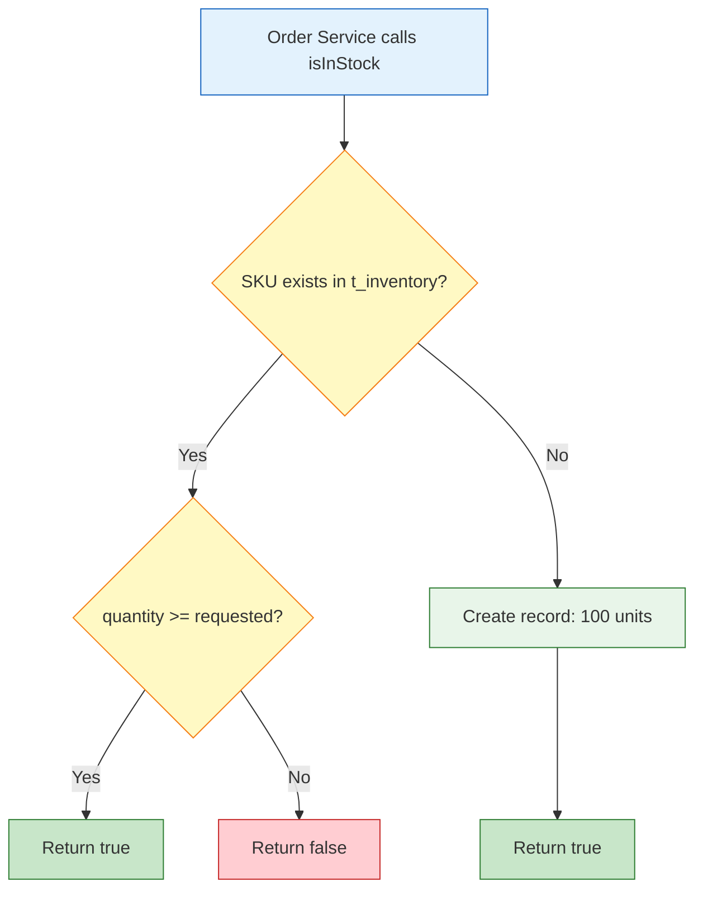

# Inventory Service

Tracks stock levels for every product SKU in the platform. The order service calls this before placing any order to verify that the requested quantity is actually available.

Built with **Spring Boot 3** and **Spring Data JPA** backed by **MySQL**. The database schema is managed by **Flyway** migrations, so table structure is version-controlled and reproducible across environments.

## What it does

- Answers "is SKU X available in quantity Y?" via `GET /api/inventory`
- Auto-provisions 100 units of stock the first time an unknown SKU is queried, so new catalog items are immediately orderable
- Provides a `POST /api/inventory` endpoint to manually set or update stock levels
- Manages the `t_inventory` table with Flyway migrations

## Auto-provisioning

This is the key behavior that ties the product catalog to inventory. When the product service adds a new item (say `galaxy_z_fold_7`), there's no inventory record for it yet. Instead of failing with "not in stock", the inventory service creates a record with 100 units on the fly:



This means you can add any product through the frontend and order it right away without manually seeding inventory.

## API

### `GET /api/inventory?skuCode={sku}&quantity={qty}`

Checks if the given SKU has enough stock. Called internally by the order service.

| Parameter | Type | Description |
|---|---|---|
| `skuCode` | String | The product SKU to check |
| `quantity` | Integer | How many units are needed |

**Response** `200 OK` — returns `true` or `false`.

### `POST /api/inventory`

Creates or updates an inventory record. Useful for restocking.

**Request body**
```json
{
  "skuCode": "iphone_15",
  "quantity": 250
}
```

**Response** `201 Created` — returns the saved inventory entity.

## Database schema

Table: `t_inventory` (managed by Flyway)

| Column | Type | Description |
|---|---|---|
| `id` | BIGINT (PK, auto-increment) | Row identifier |
| `sku_code` | VARCHAR(255) | Product SKU code |
| `quantity` | INT | Units available |

### Seed data (V2 migration)

The second migration pre-loads stock for the initial catalog:

| SKU | Quantity |
|---|---|
| `iphone_15` | 100 |
| `pixel_8` | 100 |
| `galaxy_24` | 100 |
| `oneplus_12` | 100 |

Any SKU not in this list gets auto-provisioned when first accessed.

## Running locally

Prerequisites: Java 21, Maven, MySQL on port 3308.

```bash
mysql -u root -p -e "CREATE DATABASE IF NOT EXISTS inventory_service;"

mvn clean package -DskipTests
java -jar target/inventory-service-0.0.1-SNAPSHOT.jar
```

The service starts on `http://localhost:8082`. Flyway runs on startup and creates the table plus seed data automatically.

## Configuration

| Property | Default | Docker override |
|---|---|---|
| `server.port` | `8082` | `8082` |
| `spring.datasource.url` | `jdbc:mysql://localhost:3308/inventory_service` | `jdbc:mysql://mysql-inventory:3306/inventory_service` |
| `spring.datasource.username` | `root` | `root` |
| `spring.datasource.password` | `mysql` | `mysql` |

## Project structure

```
src/main/java/.../inventory/
├── controller/
│   └── InventoryController.java    # GET (stock check) + POST (restock)
├── exception/
│   └── GlobalExceptionHandler.java # RFC 7807 error responses
├── model/
│   └── Inventory.java              # JPA entity for t_inventory
├── repository/
│   └── InventoryRepository.java    # JPA repo + findBySkuCode
└── service/
    └── InventoryService.java       # Stock check + auto-provisioning logic

src/main/resources/
├── application.properties
├── application-docker.properties
└── db/migration/
    ├── V1__init.sql                # Create t_inventory table
    └── V2__add_inventory.sql       # Seed initial stock data
```

## Tech stack

- Spring Boot 3.3.5
- Spring Data JPA + Hibernate
- MySQL 8.3
- Flyway (schema migrations)
- SpringDoc OpenAPI 2.6
- Micrometer + Prometheus
- Lombok
